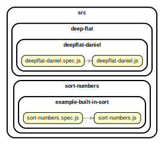

<!-- BEGIN TITLE -->

# DOCS

<!-- END TITLE -->

<!-- BEGIN TREE -->

> [interactive graph](./dependency-graph.html)



<!-- END TREE -->

<!-- BEGIN TOC -->

- deep-flat
  - deepflat-daniel
    - [deepflat-daniel.js](#srcdeep-flatdeepflat-danieldeepflat-danieljs)
- difference
  - solution-class-sunday
    - [difference.js](#srcdifferencesolution-class-sundaydifferencejs)
- intersection
  - for-loops-rayane
    - [intersection-rayane.js](#srcintersectionfor-loops-rayaneintersection-rayanejs)
- sort-numbers
  - example-built-in-sort
    - [sort-numbers.js](#srcsort-numbersexample-built-in-sortsort-numbersjs)

---

<!-- END TOC -->

---

<!-- BEGIN DOCS -->

# /deep-flat

## /deepflat-daniel

<details><summary><a href="../../src/deep-flat/deepflat-daniel/deepflat-daniel.js" id="srcdeep-flatdeepflat-danieldeepflat-danieljs">../src/deep-flat/deepflat-daniel/deepflat-daniel.js</a></summary>

<a name="deepFlatDaniel"></a>

## deepFlatDaniel ⇒ <code>Array</code>

Converts a nested array into a single array with no nesting.

It returns a new array and there are no side-effects.

**Returns**: <code>Array</code> - Returns the new flattened array.

| Param   | Type               | Default         | Description           |
| ------- | ------------------ | --------------- | --------------------- |
| [array] | <code>Array</code> | <code>[]</code> | The array to flatten. |

**Example**

```js
deepFlat([1, [2, [3, [4]], 5]]);
// -> [1, 2, 3, 4, 5]
```

**Example**

```js
deepFlat(["a", ["b", [["c"], ["d"]], "e"]]);
// -> ['a', 'b', 'c', 'd', 'e']
```

</details>

---

---

# /difference

## /solution-class-sunday

<details><summary><a href="../../src/difference/solution-class-sunday/difference.js" id="srcdifferencesolution-class-sundaydifferencejs">../src/difference/solution-class-sunday/difference.js</a></summary>

<a name="difference"></a>

## difference ⇒ <code>Array</code>

Creates an array of values that are in the first array, but not not in the second array.

Repeated values are not duplicated in the return value, and the order of result values are determined by the first array.

**Note:** This function returns a new array, and has no side-effects.

**Returns**: <code>Array</code> - Returns the new array of filtered values.

| Param    | Type               | Default         | Description            |
| -------- | ------------------ | --------------- | ---------------------- |
| [array]  | <code>Array</code> | <code>[]</code> | The array to inspect.  |
| [values] | <code>Array</code> | <code>[]</code> | The values to exclude. |

**Example**

```js
difference([2, 1], [2, 3]); //  [1]
```

**Example**

```js
difference([1, 2, 1], [2, 3]); //  [1]
```

</details>

---

---

# /intersection

## /for-loops-rayane

<details><summary><a href="../../src/intersection/for-loops-rayane/intersection-rayane.js" id="srcintersectionfor-loops-rayaneintersection-rayanejs">../src/intersection/for-loops-rayane/intersection-rayane.js</a></summary>

<a name="findIntersection"></a>

## findIntersection ⇒ <code>Array</code>

Creates an array of values that are in both the first and the second arrays.

Repeated values are not duplicated in the return value, and the order of result values are determined by the first array.

**Note:** This function returns a new array, and has no side-effects.

**Returns**: <code>Array</code> - Returns the new array of filtered values.

| Param    | Type               | Default         | Description            |
| -------- | ------------------ | --------------- | ---------------------- |
| [array1] | <code>Array</code> | <code>[]</code> | The array to inspect.  |
| [array2] | <code>Array</code> | <code>[]</code> | The values to include. |

**Example**

```js
intersection([2, 1], [2, 3]);
// -> [2]
```

**Example**

```js
intersection([2, 1, 2], [2, 3]);
// -> [2]
```

</details>

---

---

# /sort-numbers

## /example-built-in-sort

<details><summary><a href="../../src/sort-numbers/example-built-in-sort/sort-numbers.js" id="srcsort-numbersexample-built-in-sortsort-numbersjs">../src/sort-numbers/example-built-in-sort/sort-numbers.js</a></summary>

<a name="sortNumbers"></a>

## sortNumbers ⇒ <code>Array.&lt;number&gt;</code>

Sorts an array of numbers from smallest to largest.

Returns a new array without modifying the original array.

Does not need to support: NaN, Infinity, -Infinity.

**Returns**: <code>Array.&lt;number&gt;</code> - A new array with the same numbers, but sorted.

| Param          | Type                              | Default         | Description                   |
| -------------- | --------------------------------- | --------------- | ----------------------------- |
| [arrOfNumbers] | <code>Array.&lt;number&gt;</code> | <code>[]</code> | The array of numbers to sort. |

**Example**

```js
sortNumbers([1.5, 1, -1.5, 0, -1]);
// -> [-1.5, -1, 0, 1, 1.5]
```

**Example**

```js
sortNumbers([-1, 0, 1]);
// -> [-1, 0, 1]
```

</details>

---

---

<!-- END DOCS -->
